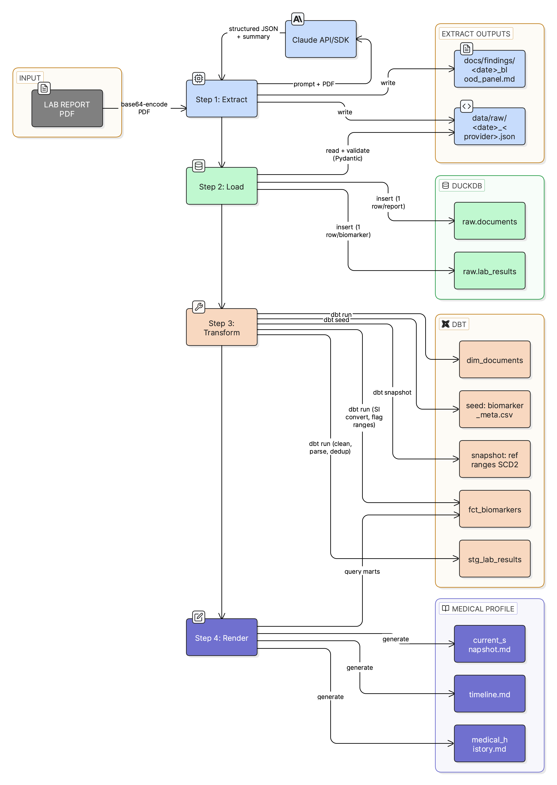

# Soma - Your Biological Digital Twin

A local-first personal health data pipeline that turns scattered lab report PDFs into a structured, queryable health record. A "biological digital twin" you fully own and control.



## Why

Most people accumulate lab reports from different providers over years, in different formats, with different units and reference ranges. The reports sit in folders or email attachments, making it hard to spot trends, compare values across time, or prepare meaningfully for a doctor's visit.

Soma fixes this by extracting biomarker data from your PDFs, standardizing everything to SI units, tracking changes over time, and generating clean markdown summaries. You can see at a glance which values are out of range, how they've trended, and whether a supplement or lifestyle change correlates with improvement.

Combined with a lifestyle and supplement profile, the generated knowledge base gives an LLM agent ("Dr. Claude") the full context it needs to reason about your health - flag patterns a single lab report wouldn't reveal, prepare pre-visit summaries for your doctor, or help you design and evaluate personal health experiments.

## Privacy

Soma does not send any data anywhere by default. All health data - biomarkers, genetic variants, profile files, generated reports - stays on your machine in a local DuckDB database and gitignored files. Nothing is committed to version control.

Cloud LLM usage (Anthropic API) is opt-in and only triggered when you explicitly run extraction commands. When using the API, you can redact personal information (name, address, DOB, insurance IDs) from PDFs before they are sent - copy `profile/templates/redact.template.yml` to `profile/redact.yml` and list the strings to black out. The original file is never modified. For sensitive documents like genetic reports, you can use `--method manual` to extract data without the PDF ever leaving your machine.

Genetic data is permanent and reveals information about your relatives. Biomarker panels can be re-identifying. Consider these risks before sending health data to any cloud provider. See [PRIVACY_DISCLAIMER.md](PRIVACY_DISCLAIMER.md) for a detailed discussion.

## Quick Start

```bash
# Set up environment
python -m venv .venv
source .venv/bin/activate
pip install -r requirements.txt

# Copy config files and add your API key
cp dbt_project/profiles.yml.example dbt_project/profiles.yml
cp .env.example .env  # then edit .env with your Anthropic API key

# Extract biomarkers from a lab report PDF
python cli.py extract --pdf /path/to/report.pdf

# Or run the full pipeline at once
python cli.py run --pdf /path/to/report.pdf
```

## Commands

### Ingest data

| Step | Command | Description |
|------|---------|-------------|
| 1-4 | **`run`** | **Full pipeline: extract, load, transform, render** |
| 1 | `extract` | Extract biomarkers from a PDF (API or manual) |
| 2 | `load` | Ingest JSON files into DuckDB |
| 3 | `transform` | Run dbt pipeline (seed, run, snapshot) |
| 4 | `render` | Generate profile markdown from dbt marts |
| (5) | `update-baseline` | Propose derived baseline updates via Claude |

### Maintain database

| Command | Description |
|---------|-------------|
| `status` | Show pipeline summary |
| `query` | Run a SQL query against DuckDB |
| `reload` | Delete and re-load data for a source file |
| `reset` | Delete the database and start fresh |

Use `python cli.py <command> --help` to see options for any command, e.g. `python cli.py extract --help`.

## How It Works

1. **Extract** - Claude reads a lab report PDF and outputs structured JSON + a markdown summary
2. **Load** - JSON files are ingested into DuckDB raw tables (idempotent by source file)
3. **Transform** - dbt cleans, deduplicates, converts to SI units, and flags range compliance
4. **Render** - Generates markdown snapshots of your current biomarker status, timeline, and medical history

## Example Run

You set up your API key once, then run a single command:

```bash
python cli.py run --pdf /path/to/your_bloodwork.pdf
```

Without `--pdf`, `run` skips extraction and runs load -> transform -> render on existing JSON files in `data/raw/`. Useful for reprocessing after editing JSON or dbt models.

`run` chains four steps automatically:

**Step 1: Extract** - Reads your PDF, base64-encodes it, sends it to Claude Sonnet with the extraction prompt. Claude returns structured JSON (biomarker names, values, units, reference ranges, LOINC codes) and a markdown summary. Two files are written:
- `data/raw/2026-02-24_blood_panel_<provider>_<timestamp>.json` - the structured data
- `docs/findings/2026/2026-02-24_blood_panel_<provider>.md` - the narrative summary

**Step 2: Load** - Reads the JSON, validates it against the Pydantic schema, and inserts rows into DuckDB (`data/soma.duckdb`):
- `raw.lab_results` - one row per biomarker (value, unit, reference range, as-is from the report)
- `raw.documents` - one row for the report itself (date, provider, type, biomarker count)
- Idempotent by source file - if you run it again, it skips files whose source PDF has already been loaded. It is safe to leave all JSON files in `data/raw/` permanently

**Step 3: Transform** - dbt seed loads the 40-biomarker reference table with SI conversion factors. dbt run builds the analytical views:
- `stg_lab_results` - cleans values, parses detection limits (`<0.1` -> `0.05` + flag), deduplicates
- `fct_biomarkers` - joins with the seed, converts to SI units, flags values outside reference/optimal ranges
- `dim_documents` - document catalog
- dbt snapshot captures reference ranges for SCD2 tracking

**Step 4: Render** - Queries the dbt marts and generates three markdown files in `docs/profile/`:
- `current_snapshot.md` - latest value per biomarker, grouped by category, with trend arrows and range flags
- `timeline.md` - chronological list of all reports
- `medical_history.md` - conditions and findings from `profile/baseline.yml` (if it exists)

### What gets created

| Artifact | Type | Gitignored? |
|----------|------|-------------|
| `data/raw/<date>_<provider>_<time>.json` | New file | Yes |
| `docs/findings/2026/<date>_blood_panel_<provider>.md` | New file | Yes |
| `data/soma.duckdb` | Updated (new rows in raw tables, views refreshed) | Yes |
| `docs/profile/current_snapshot.md` | Regenerated | Yes |
| `docs/profile/timeline.md` | Regenerated | Yes |
| `docs/profile/medical_history.md` | Regenerated | Yes |

Profile YAMLs (`profile/*.yml`) are not touched by the pipeline. Those are only written by you (manually copying templates and filling in data) or by `soma update-baseline` (which calls Claude to propose derived findings, then asks you to approve the diff).

## Profile Layer

Copy templates from `profile/templates/` to `profile/` and fill in your data:

- `baseline.yml` - Static facts and agent-derived findings
- `lifestyle.yml` - Diet, exercise, sleep
- `supplements.yml` - Current and past supplements
- `medications.yml` - Current and past medications
- `experiments.yml` - Time-bounded health protocols
- `redact.yml` - PII strings to black out from PDFs before API calls

## Data Access

Query the database directly from the CLI:

```bash
python cli.py query "SELECT * FROM fct_biomarkers WHERE report_date = '2026-02-24'"
python cli.py query "SELECT source_file, COUNT(*) FROM raw.lab_results GROUP BY source_file"
```

For interactive analysis in Python, load any table as a pandas DataFrame:

```python
import duckdb
con = duckdb.connect("data/soma.duckdb", read_only=True)
df = con.sql("SELECT * FROM fct_biomarkers").df()
```
